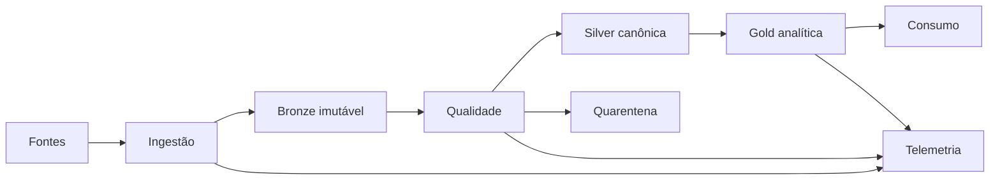

# Introdução

Projetos de dados falham nas fronteiras: schema muda, replay duplica, join multiplica, checkpoint desaparece ou uma saída parcial é publicada. O projeto final avalia essas interfaces, não apenas transformações.

Cada etapa possui entrada, saída, invariantes, identificador de execução e procedimento de recuperação.
