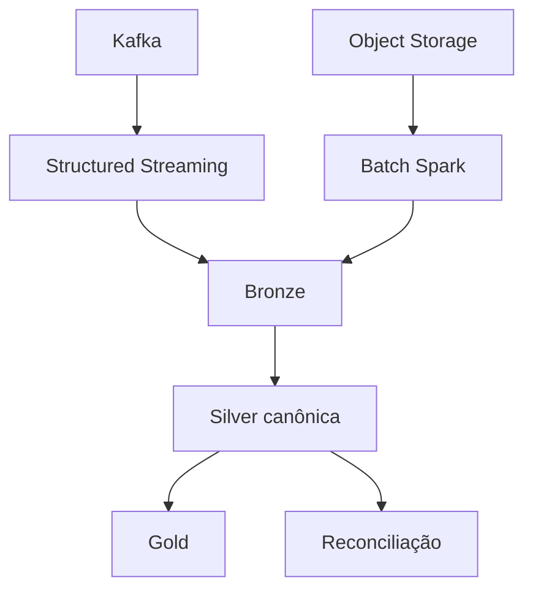

# Arquitetura Batch, Streaming e Camadas de Dados

Streaming captura eventos e produz visão recente; batch reconcilia o histórico autoritativo. Ambos reutilizam funções canônicas de normalização e qualidade. A convergência ocorre em tabelas com chave, versão e regra de precedência explícitas.

Bronze preserva payload, metadados e sequência. Silver aplica schema, deduplicação e semântica. Gold materializa granularidades de consumo. Quarentena não é lixo: possui motivo, origem, versão e ciclo de correção.

