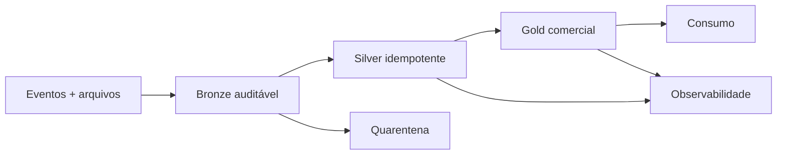

# Estudo de Caso — Plataforma Spark da DataRetail

A DataRetail implementa o projeto em três incrementos. Primeiro, batch diário cria Bronze e Silver com reconciliação. Depois, Gold publica receita e recorrência. Por fim, streaming antecipa a visão intradiária, reconciliada pelo batch seguinte.

No teste final, um evento duplicado, uma chave skewed e uma falha de publicação são injetados. O pipeline deduplica, mantém SLA e preserva a versão anterior até o retry aprovado.
