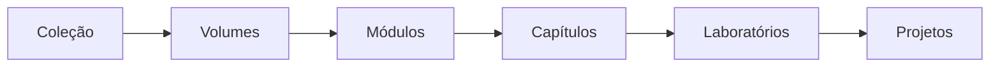
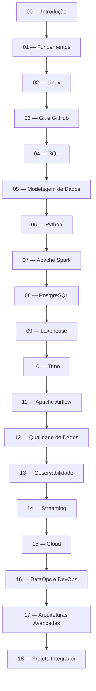

# ROADMAP.md

## Roadmap

## Formação em Engenharia de Dados

---

## Objetivo

Este documento representa o planejamento oficial da coleção **Formação em Engenharia de Dados**.

Seu propósito é registrar a estrutura vigente em `100-Volumes`, a ordem de estudo, o progresso atual e os próximos passos. A estrutura física existente é a fonte oficial para nomes e numeração dos volumes; qualquer alteração futura exige autorização explícita e registro no `CHANGELOG.md`.

---

## Estado Atual

| Item                  | Status                |
| --------------------- | --------------------- |
| Estrutura do Vault    | ✅ Concluída           |
| Governança do Projeto | 🚧 Em consolidação    |
| Volume 00             | 🚧 Em desenvolvimento |
| Volume 01             | ✅ Concluído |
| Volume 02             | ✅ Concluído           |
| Volume 03             | ✅ Concluído           |
| Volume 04             | ✅ Concluído |
| Volume 05             | ✅ Concluído           |
| Volume 06             | 🚧 Em desenvolvimento |
| Volumes 07 a 18       | ⏳ Estruturados        |

---

## Estrutura Geral da Formação

---

## Planejamento Oficial dos Volumes

| Volume | Diretório | Domínio | Status |
| ------ | --------- | ------- | ------ |
| 00 | `00-Introducao` | Introdução | 🚧 Em desenvolvimento |
| 01 | `01-Fundamentos` | Fundamentos | 🚧 Em desenvolvimento |
| 02 | `02-Linux` | Linux | ⏳ Estruturado |
| 03 | `03-Git-e-GitHub` | Git e GitHub | ✅ Concluído |
| 04 | `04-SQL` | SQL | ✅ Concluído |
| 05 | `05-Modelagem-de-Dados` | Modelagem de Dados | ✅ Concluído |
| 06 | `06-Python` | Python | 🚧 Em desenvolvimento |
| 07 | `07-Apache-Spark` | Apache Spark | ⏳ Estruturado |
| 08 | `08-PostgreSQL` | PostgreSQL | ⏳ Estruturado |
| 09 | `09-Lakehouse` | Lakehouse | ⏳ Estruturado |
| 10 | `10-Trino` | Trino | ⏳ Estruturado |
| 11 | `11-Apache-Airflow` | Apache Airflow | ⏳ Estruturado |
| 12 | `12-Qualidade-de-Dados` | Qualidade de Dados | ⏳ Estruturado |
| 13 | `13-Observabilidade` | Observabilidade | ⏳ Estruturado |
| 14 | `14-Streaming` | Streaming | ⏳ Estruturado |
| 15 | `15-Cloud` | Cloud | ⏳ Estruturado |
| 16 | `16-DataOps-e-DevOps` | DataOps e DevOps | ⏳ Estruturado |
| 17 | `17-Arquiteturas-Avancadas` | Arquiteturas Avançadas | ⏳ Estruturado |
| 18 | `18-Projeto-Integrador` | Projeto Integrador | ⏳ Estruturado |

> [!note]
> “Estruturado” significa que o diretório do volume e seus arquivos de controle existem. Não significa que o conteúdo técnico esteja concluído.

---

## Volume 00 — Introdução

**Objetivo:** apresentar a profissão, o ecossistema de dados, a estrutura da academia e a preparação do ambiente de estudos.

Status: ✅ Concluído

### Módulos

| Módulo | Status |
| ------ | ------ |
| 00 — Apresentação | 🚧 Parcial |
| 01 — O que é Engenharia de Dados | 🚧 Parcial |
| 02 — Ecossistema de Dados | ⏳ Estruturado |
| 03 — Arquiteturas Modernas | ⏳ Estruturado |
| 04 — Projeto Integrador | ⏳ Estruturado |
| 05 — Ambiente da Academia | ⏳ Estruturado |
| 06 — Como Estudar | ⏳ Estruturado |
| 07 — Roadmap | ⏳ Estruturado |
| 08 — Preparação do Ambiente | ⏳ Estruturado |
| 09 — Encerramento | ⏳ Estruturado |

---

## Volume 01 — Fundamentos

**Objetivo:** construir a base conceitual necessária para compreender sistemas, plataformas e arquiteturas de dados.

Status: ✅ Concluído

### Módulos

| Módulo | Status |
| ------ | ------ |
| 01 — Dados | ✅ Concluído |
| 02 — Ciclo de Vida dos Dados | ✅ Concluído |
| 03 — Bancos de Dados | ✅ Concluído |
| 04 — Modelagem | ✅ Concluído |
| 05 — ETL | ✅ Concluído |
| 06 — ELT | ✅ Concluído |
| 07 — Pipelines | ✅ Concluído |
| 08 — Arquiteturas | ✅ Concluído |
| 09 — Qualidade | ✅ Concluído |
| 10 — Governança | ✅ Concluído |
| 11 — Observabilidade | ✅ Concluído |
| 12 — Conceitos Modernos | ✅ Concluído |

### Ponto de continuidade

O Módulo 12 — Conceitos Modernos e o Volume 01 — Fundamentos foram concluídos.

---

## Volume 02 — Linux

**Objetivo:** desenvolver competências de sistema operacional, automação e diagnóstico necessárias à engenharia de dados.

Status: ✅ Concluído

### Módulos

| Módulo | Status |
| ------ | ------ |
| 01 — Fundamentos do Linux | ✅ Concluído |
| 02 — Administração do Sistema Linux | ✅ Concluído |
| 03 — Shell Script e Automação | ✅ Concluído |
| 04 — Redes e Conectividade no Linux | ✅ Concluído |
| 05 — Contêineres e Isolamento no Linux | ✅ Concluído |
| 06 — Desempenho, Troubleshooting e Observabilidade Linux | ✅ Concluído |
| 07 — Segurança e Hardening Linux | ✅ Concluído |
| 08 — Operação de Plataformas de Dados no Linux | ✅ Concluído |

### Ponto de continuidade

O Volume 02 — Linux está concluído.

---

## Volume 03 — Git e GitHub

**Objetivo:** desenvolver versionamento distribuído, colaboração, revisão e governança de mudanças.

Status: ✅ Concluído

### Módulos

| Módulo | Status |
| ------ | ------ |
| 01 — Fundamentos do Git | ✅ Concluído |
| 02 — Branches, Colaboração e GitHub | ✅ Concluído |
| 03 — GitHub Actions e CI/CD | ✅ Concluído |
| 04 — Releases, Versionamento e GitOps | ✅ Concluído |

### Ponto de continuidade

O Volume 03 — Git e GitHub está concluído. O próximo trabalho é estruturar e iniciar o Volume 04 — SQL.

---

## Volume 04 — SQL

**Objetivo:** desenvolver raciocínio relacional, consultas, manipulação e análise de dados com SQL.

Status: ✅ Concluído

### Módulos

| Módulo | Status |
| ------ | ------ |
| 01 — Fundamentos de SQL e Modelo Relacional | ✅ Concluído |
| 02 — Consultas, Joins e Subconsultas | ✅ Concluído |
| 03 — Agregações, Funções de Janela e Análise | ✅ Concluído |
| 04 — DML, Transações e Concorrência | ✅ Concluído |
| 05 — DDL, Schemas e Evolução de Estruturas | ✅ Concluído |
| 06 — Planos de Execução, Índices e Otimização | ✅ Concluído |
| 07 — Views, Segurança e Governança SQL | ✅ Concluído |
| 08 — SQL em Pipelines e Plataformas Analíticas | ✅ Concluído |
| 09 — Dados Temporais e Semiestruturados em SQL | ✅ Concluído |
| 10 — Testes, Qualidade e Observabilidade SQL | ✅ Concluído |

### Ponto de continuidade

O Volume 04 está concluído. O próximo trabalho é estruturar e iniciar o Módulo 01 — Fundamentos e Níveis de Modelagem do Volume 05.

---

## Volume 05 — Modelagem de Dados

**Objetivo:** representar domínios operacionais e analíticos com semântica, histórico e governança.

Status: ✅ Concluído

### Módulos

| Módulo | Status |
| ------ | ------ |
| 01 — Fundamentos e Níveis de Modelagem | ✅ Concluído |
| 02 — Modelagem Conceitual e Entidade-Relacionamento | ✅ Concluído |
| 03 — Modelagem Lógica Relacional e Normalização | ✅ Concluído |
| 04 — Modelagem Física, Desnormalização e Desempenho | ✅ Concluído |
| 05 — Modelagem Dimensional, Fatos e Dimensões | ✅ Concluído |
| 06 — Histórico Dimensional, SCD, Snapshots e Bridges | ✅ Concluído |
| 07 — Data Vault 2.0 e Integração Histórica | ✅ Concluído |
| 08 — Modelagem para Data Lake, Lakehouse e Produtos de Dados | ✅ Concluído |

### Ponto de continuidade

O Volume 05 está concluído. O próximo trabalho é estruturar e iniciar o Módulo 01 — Fundamentos, Ambiente e Ferramentas Python do Volume 06.

---

## Ordem Recomendada de Estudo

---

## Critério de Conclusão

Um módulo somente pode ser considerado concluído quando possuir:

* README;
* Objetivos;
* Introdução;
* capítulos técnicos;
* Estudo de Caso;
* Resumo;
* Perguntas de Entrevista;
* Exercícios;
* Gabarito;
* Laboratório;
* Solução;
* Referências.

---

## Continuidade

Antes de criar novos conteúdos, colaboradores e agentes devem:

1. consultar a estrutura existente em `100-Volumes`;
2. confirmar o estado neste ROADMAP;
3. confirmar o próximo marco no `MEMORY.md` e no `PROJECT_STATUS.md`;
4. verificar se já existe conteúdo parcial;
5. continuar exatamente do ponto registrado.

Nunca duplicar capítulos nem reiniciar módulos concluídos.

---

## Evolução

Os nomes e números registrados neste documento correspondem aos diretórios existentes e formam a estrutura oficial da coleção.

Alterações arquiteturais devem:

* ser autorizadas explicitamente;
* preservar Wikilinks e navegação;
* evitar renumeração de volumes publicados;
* ser refletidas em `README.md`, `ARCHITECTURE.md`, `MEMORY.md` e `PROJECT_STATUS.md`;
* ser registradas no `CHANGELOG.md`.

---

## Visão de Longo Prazo

A Formação em Engenharia de Dados pretende tornar-se uma referência aberta em língua portuguesa, cobrindo desde fundamentos até plataformas modernas, operação de dados e arquiteturas avançadas. O Projeto Integrador da DataRetail S.A. consolida os conhecimentos desenvolvidos ao longo da coleção.
